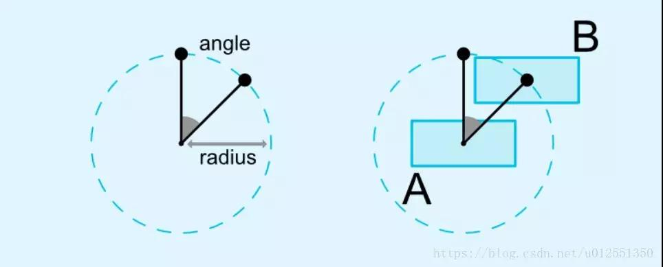

## ConstraintLayout

1. Circular positioning（圆形定位）:可以将一个控件的中心以一定的角度和距离约束到
另一个控件的中心，相当于在一个圆上放置一个控件



```xml
    <Button
        android:id="@+id/btn_a"
        android:layout_width="wrap_content"
        android:layout_height="wrap_content"
        android:layout_marginLeft="4dp"
        android:layout_marginTop="100dp"
        android:text="A"
        app:layout_constraintLeft_toLeftOf="parent"
        app:layout_constraintTop_toTopOf="parent" />

    <Button
        android:id="@+id/btn_b"
        android:layout_width="wrap_content"
        android:layout_height="wrap_content"
        android:text="B"
        app:layout_constraintCircle="@+id/btn_a"
        app:layout_constraintCircleAngle="45"
        app:layout_constraintCircleRadius="100dp" />
```

2. 填充父窗体约束
```xml
  <Button
        android:id="@+id/btn_e"
        android:layout_width="0dp"
        android:layout_height="wrap_content"
        android:layout_marginTop="8dp"
        android:text="填充父窗体约束"
        app:layout_constraintEnd_toEndOf="parent"
        app:layout_constraintStart_toStartOf="parent"
        app:layout_constraintTop_toTopOf="parent"
        app:layout_constraintWidth_percent="0.5" />
```

3. Barrier 直译为障碍、屏障。在约束布局中，可以使用属性constraint_referenced_ids属性
来引用多个带约束的组件，从而将它们看作一个整体
```xml
 <TextView
        android:id="@+id/tv_name"
        android:layout_width="wrap_content"
        android:layout_height="wrap_content"
        android:text="姓名："
        app:layout_constraintBottom_toBottomOf="@+id/et_name"
        app:layout_constraintTop_toTopOf="@+id/et_name" />

    <TextView
        android:id="@+id/tv_contract"
        android:layout_width="wrap_content"
        android:layout_height="wrap_content"
        android:layout_marginTop="8dp"
        android:text="联系方式："
        app:layout_constraintBottom_toBottomOf="@+id/et_contract"
        app:layout_constraintTop_toTopOf="@+id/et_contract" />

    <android.support.constraint.Barrier
        android:id="@+id/barrier"
        android:layout_width="wrap_content"
        android:layout_height="wrap_content"
        app:constraint_referenced_ids="tv_name,tv_contract"
        app:barrierDirection="right"/>

    <EditText
        android:id="@+id/et_name"
        android:layout_width="0dp"
        android:layout_height="wrap_content"
        android:hint="请输入姓名"
        app:layout_constraintLeft_toLeftOf="@+id/barrier"
        app:layout_constraintRight_toRightOf="parent"
        app:layout_constraintTop_toTopOf="parent" />

    <EditText
        android:id="@+id/et_contract"
        android:layout_width="0dp"
        android:layout_height="wrap_content"
        android:hint="请输入联系方式"
        app:layout_constraintLeft_toLeftOf="@+id/barrier"
        app:layout_constraintRight_toRightOf="parent"
        app:layout_constraintTop_toBottomOf="@+id/et_name" />
        
```

4. Group 用于控制多个控件的可见性,如下，改变group的可见性，就可以改变下面两个按钮的可见性
```xml
<android.support.constraint.Group
        android:layout_width="wrap_content"
        android:layout_height="wrap_content"
        app:constraint_referenced_ids="btn_f,btn_g"
        android:visibility="visible" />

    <Button
        android:id="@+id/btn_f"
        android:layout_width="wrap_content"
        android:layout_height="wrap_content"
        android:layout_marginBottom="60dp"
        android:layout_marginLeft="32dp"
        android:layout_marginStart="32dp"
        android:text="F"
        app:layout_constraintStart_toStartOf="parent" />

    <Button
        android:id="@+id/btn_g"
        android:layout_width="wrap_content"
        android:layout_height="wrap_content"
        android:layout_marginLeft="40dp"
        android:text="G"
        app:layout_constraintLeft_toRightOf="@+id/btn_f"
        app:layout_goneMarginLeft="120dp" />
```
5. 控制子View的宽高比,宽度和高度1:1

```xml
    <!--宽高比为1:1-->
   <Button
           android:layout_width="wrap_content"
           android:layout_height="0dp"
           android:text="app:layout_constraintDimensionRatio=1:1"
           android:textAllCaps="false"
           app:layout_constraintDimensionRatio="1:1"
           app:layout_constraintLeft_toLeftOf="parent"
           app:layout_constraintTop_toTopOf="parent" />
```
```xml
<!--宽高比2:1-->
<Button
        android:layout_width="wrap_content"
        android:layout_height="0dp"
        android:text="app:layout_constraintDimensionRatio=1:1"
        android:textAllCaps="false"
        app:layout_constraintDimensionRatio="1.5"
        app:layout_constraintLeft_toLeftOf="parent"
        app:layout_constraintTop_toTopOf="parent" />
```
比率的取值有两种形式：

– float 值，代表宽度/高度 的比率

– “宽度:高度”这种比率值