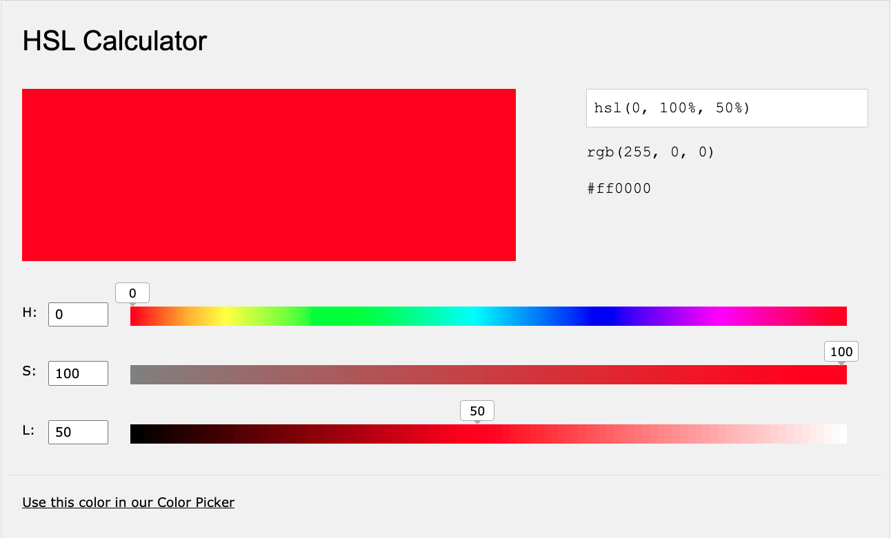

HSL即色相、饱和度、亮度（英语：Hue, Saturation, Lightness）。  
HSV即色相、饱和度、明度（英语：Hue, Saturation, Value），又称HSB，其中B即英语：Brightness。

* 色相（H）是色彩的基本属性，就是平常所说的颜色名称，如红色、黄色等。
* 饱和度（S）是指色彩的纯度，越高色彩越纯，低则逐渐变灰，取0%-100%的数值。
* 明度（V），亮度（L），取0%-100%。

### HSV

### HSL

* Hue：角度值，取值范围 0～360 ；0表示红色，120表示绿色，240表示蓝色。
* Saturation：百分比值；0% 表示灰色，100% 表示全色。
* Lightness：亮度也是一个百分比值；0%是黑色，100%是白色。

参考链接：
* [Color Convert](http://gavin-yyc.github.io/colorconvert/)
* [RGB HSV 转换](https://c.runoob.com/front-end/868)
* [测试 Colors HSL](https://www.w3schools.com/colors/colors_hsl.asp)
