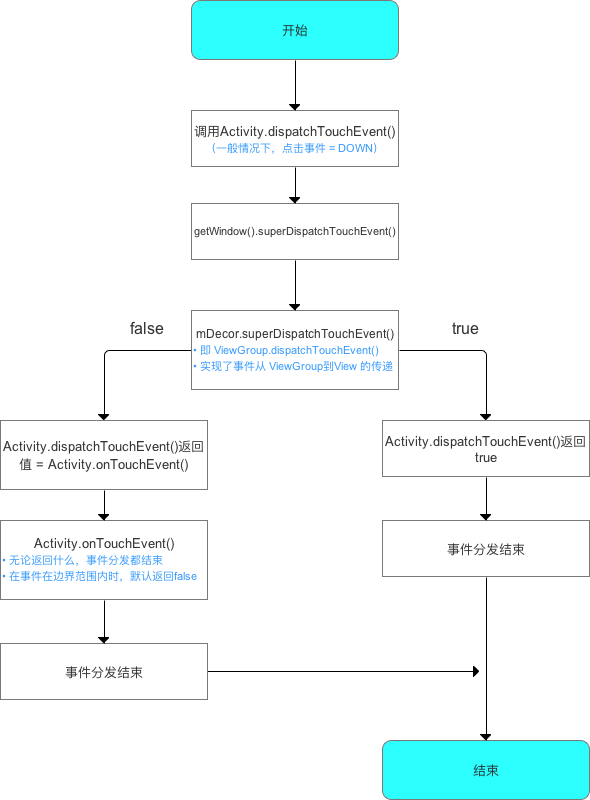
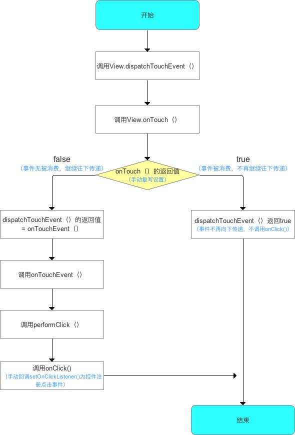

# ViewDemo
1. 自定义MaxHeightLayout，限制popWindow数据过多的时候最大高度。
2. 了解BottomSheet。
3. 了解ConstraintLayout。
4. 研究了一下自定义View的三个构造函数。




## ViewGroup事件的分发机制

从上面Activity事件分发机制可知，ViewGroup事件分发机制从dispatchTouchEvent()开始


## View事件的分发机制

从上面ViewGroup事件分发机制知道，View事件分发机制从dispatchTouchEvent()开始


如果一个View的可见性不是visible，并且view也没有与之关联的动画，那么他是收不到事件的
下面的代码摘自ViewGroup
```
/**
 * Returns true if a child view can receive pointer events.
 * @hide
 */
private static boolean canViewReceivePointerEvents(@NonNull View child) {
    return (child.mViewFlags & VISIBILITY_MASK) == VISIBLE
            || child.getAnimation() != null;
}
```
## View.post() 到底干了啥
[【Andorid源码解析】View.post() 到底干了啥](https://www.jianshu.com/p/85fc4decc947)

遍历View树
```
fun printAllChildView(view: View) {
        Log.d(TAG, "printAllChildView: ")
        val queue: Deque<View> = LinkedList<View>()
        var root = view
        queue.add(root)
        while (queue.isNotEmpty()) {
            root = queue.pop()
            Log.d(TAG, "printAllChildView: $root")
            if (root is ViewGroup) {
                for (i in 0 until root.childCount) {
                    queue.add(root.getChildAt(i))
                }

            }
        }
    }
```

#### custom_view 包下面 是《Android自定义控件开发入门与实战》的部分示例


###

1. 无论是显示软键盘时指定的flag，还是隐藏软键盘时指定的flag都只对隐藏软键盘有影响，对显示软键盘无影响

2. 分别在调用showSoftInput()时使用三个不同的标记，以及在调用hideSoftInputFromWindow()是使用三个不同的标记，对是否能够隐藏软键盘进行测试，测试结果如下。true表示可以隐藏，false表示不能隐藏。

横向表示显示软键盘传入的flag，竖向表示隐藏键盘传入的flag

| 参数 | 0 | SHOW_IMPLICIT | SHOW_FORCED |
| :-: |:-:|:-:|:-:|
| 0 | true | true | true |
| HIDE_IMPLICIT_ONLY | false | true | false |
| HIDE_NOT_ALWAYS | true | true | false|


#### getDimension()、getDimensionPixelSize()和getDimenPixelOffset()
1. 如果在xml文件中指定的单位是 dp，或者 sp的话 getDimension()、getDimensionPixelSize()和getDimenPixelOffset()的结果值都是将资源文件中定义的dip值乘以屏幕密度。

2.  如果在xml文件中指定的单位是px的话,那么getDimension()、getDimensionPixelSize()和getDimenPixelOffset()的结果值都是将资源文件中定义的px值。

3. getDimension()返回值类型是的是float，其余两个返回的是int。 其中getDimensionPixelSize()返回的是实际数值的四舍五入,而getDimensionPixelOffset返回的是实际数值去掉后面的小数点;

[getDimension()、getDimensionPixelSize()和getDimensionPixelOffset()的区别](https://www.jianshu.com/p/282032797637)

#### 关于在事件分发过程中的ACTION_CANCEL的官方描述
```
/**
 * Constant for {@link #getActionMasked}: The current gesture has been aborted.
 * You will not receive any more points in it.  You should treat this as
 * an up event, but not perform any action that you normally would.
 */
 public static final int ACTION_CANCEL           = 3;
```
