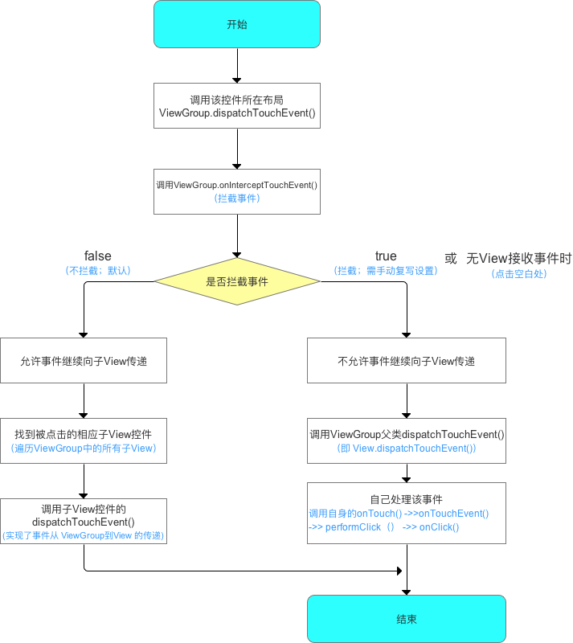

# ViewDemo
1. 自定义MaxHeightLayout，限制popWindow数据过多的时候最大高度。
2. 了解BottomSheet,感觉要是在实际中使用还是有问题的。
3. 了解ConstraintLayout
4. 研究了一下自定义View的三个构造函数

## 事件分发机制

1. 点击事件发生后，事件先传到Activity、再传到ViewGroup、最终再传到 View。要想充分理解Android分发机
制，本质上是要理解： 
* Activity对点击事件的分发机制
* ViewGroup对点击事件的分发机制
* View对点击事件的分发机制

**Activity的事件分发机制**
当一个点击事件发生时，事件最先传到 ```Activity``` 的 ```dispatchTouchEvent()``` 进行事件分发
```java
public boolean dispatchTouchEvent(MotionEvent ev) {
        // 一般事件列开始都是DOWN事件 = 按下事件，故此处基本是true
        if (ev.getAction() == MotionEvent.ACTION_DOWN) {
            onUserInteraction();
        }
        if (getWindow().superDispatchTouchEvent(ev)) {
            return true;
        }
        //分析4
        return onTouchEvent(ev);
    }
```
这个回调方法旨在帮助活动智能的管理状态栏通知
```java
 public void onUserInteraction() {
    }
```

```java
getWindow().superDispatchTouchEvent(ev);
```
获取当前Activity的window对象，Window类是抽象类，其唯一实现类 = PhoneWindow类；即此处的Window类对象 = PhoneWindow类对象

PhoneWindow类的superDispatchTouchEvent()方法
```java

    @Override
    public boolean superDispatchTouchEvent(MotionEvent event) {
        return mDecor.superDispatchTouchEvent(event);
    }
```

```java
/**
  * 分析3：mDecor.superDispatchTouchEvent(event)
  * 定义：属于顶层View（DecorView）
  * 说明：
  *     a. DecorView类是PhoneWindow类的一个内部类
  *     b. DecorView继承自FrameLayout，是所有界面的父类
  *     c. FrameLayout是ViewGroup的子类，故DecorView的间接父类 = ViewGroup
  */
    public boolean superDispatchTouchEvent(MotionEvent event) {

        return super.dispatchTouchEvent(event);
        // 调用父类的方法 = ViewGroup的dispatchTouchEvent()
        // 即 将事件传递到ViewGroup去处理，详细请看ViewGroup的事件分发机制

    }
```
```java
private final class DecorView extends FrameLayout implements RootViewSurfaceTaker {
    
}
```
分析4，Activity.onTouchEvent().当没有任何View处理点击事件的时候调用，例如当事件发生在Window边界外，没有View接收事件。
 即只有在点击事件在Window边界外才会返回true，一般情况都返回false。
```java
public boolean onTouchEvent(MotionEvent event) {
        if (mWindow.shouldCloseOnTouch(this, event)) {
            finish();
            return true;
        }

        return false;
    }
```


## ViewGroup事件的分发机制

从上面Activity事件分发机制可知，ViewGroup事件分发机制从dispatchTouchEvent()开始


## View事件的分发机制

从上面ViewGroup事件分发机制知道，View事件分发机制从dispatchTouchEvent()开始
